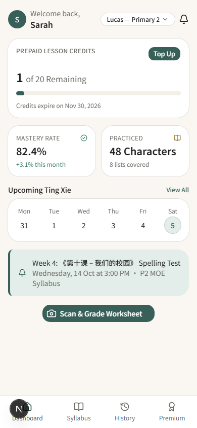
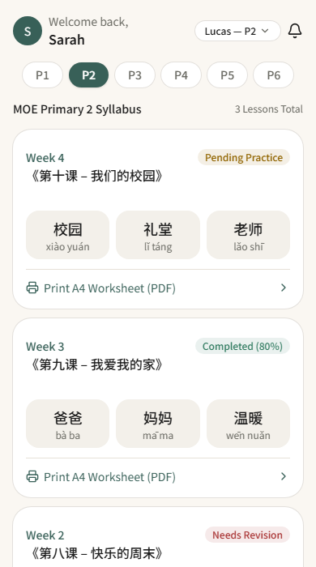
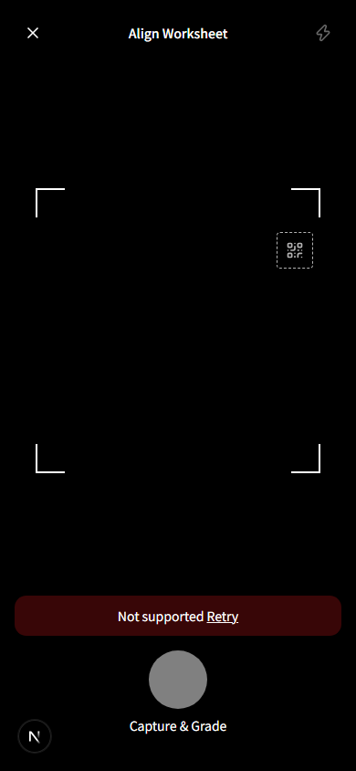
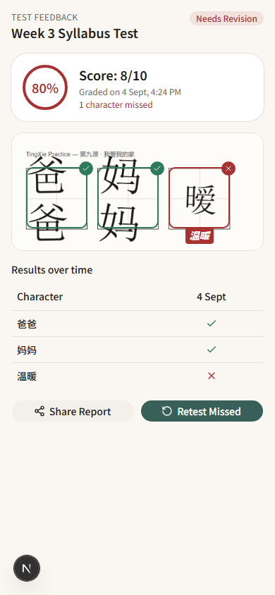
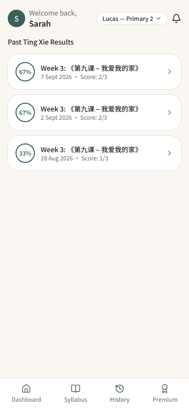
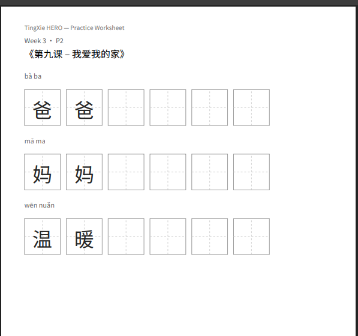

# TingXie HERO

AI-powered Chinese handwriting grading PWA — take-home technical assignment
(Junior Back-End Developer) for AiDi. Full flow: photo → backend upload →
Gemini Vision grading → correction overlay, per the assignment's evaluation
focus.

**Live URL:** _pending deployment_

## Screenshots

| Dashboard | Syllabus | Scan |
|---|---|---|
|  |  |  |

| Results | History | Print Worksheet |
|---|---|---|
|  |  |  |

Results and History above show three real graded submissions for the same
lesson across three different dates (score, per-character correction
overlay, a "Results over time" matrix that now actually has history to show,
pinyin, and a "Practice writing" stroke-order animation for the one
character still missed) — captured against temporary submissions inserted
directly into the live database for this screenshot, then deleted
immediately after (verified 0 rows remaining). The worksheet photo itself is
a synthesized demo image (not a real phone photo), built the same way for
this screenshot only. The shipped database starts empty; see
**Known limitations** below for why no demo data is seeded permanently.

Scan shows the real camera screen's UI shell — header, alignment brackets,
QR target box, shutter button — with the graceful "Not supported" fallback
this sandbox's fake camera device always hits (see **Known limitations**);
`docs/reference/mockups/screen3-camera.png` shows the target design with a
live feed for comparison. Print Worksheet is the actual generated Tian Zige
practice-sheet PDF (`generateWorksheetPdf`, real output, not a mockup),
rendered here in a PDF viewer.

## For reviewers: open the architecture diagrams first

Before reading source files, open these two in a browser (double-click, no
server needed):

- [`docs/architecture/system-architecture.html`](docs/architecture/system-architecture.html)
  — the full component map: parent's phone → this PWA → the App Router
  server → Supabase (Postgres + Storage) and Gemini. Includes the one
  deliberate exception to "the browser never talks to a backing service
  directly": the stroke-order practice section fetches its stroke data
  straight from `hanzi-writer`'s CDN, client-side, bypassing the server —
  drawn as a dashed line so it reads as the exception it is.
- [`docs/architecture/grading-flow.html`](docs/architecture/grading-flow.html)
  — the exact scan-to-grade request sequence, message by message: upload,
  the server fetching its own uploaded photo back for Gemini, the Gemini
  call, **the write to `character_results` before the response goes out**
  (easy to miss reading the route handler top-to-bottom), then the
  red-pen overlay returned to the client.

Both are self-contained, interactive (pan/zoom, light/dark theme, a guided
"Play story" walkthrough per view), and kept in sync with the actual code —
not drawn once and left to rot. If anything in either diagram ever disagrees
with `src/`, trust the code and tell me; the diagram is wrong, not the app.

## Highlights

- **The evaluated flow works end-to-end, with real data at every step.**
  Photo → `POST /api/upload` → `POST /api/grade` (a real Gemini call) →
  Supabase writes → a red-pen/green-check overlay drawn on the actual graded
  photo, positioned from Gemini's own bounding boxes. That overlay is the
  assignment's own named "key evaluation point" — not a stand-in table, an
  actual mark on the actual photo.
- **Tested where it matters, not everywhere for its own sake.** 82 Vitest
  unit tests (26 files) cover every entity function's business logic —
  Gemini response parsing, score computation, the grade-submission
  pipeline's full orchestration order — against fakes, no live credentials
  needed to run them. 6 Playwright E2E tests cover navigation and both
  History states; the populated-history case manages its own real Supabase
  fixture (insert, verify, delete, confirm 0 rows remain) instead of relying
  on whatever happens to already be in the database.
- **Reviewed, not just built and shipped.** Two security-review passes and a
  Standards+Spec code-review caught and fixed a real bug before it could
  affect anyone — a prototype-pollution-adjacent object lookup
  (`plainObject["__proto__"]`) that could have crashed the Results page for
  a submission with an unlucky Gemini-returned string. `FSD_TingXieHero.md`
  §6 documents every audit run against this codebase, including the ones
  that correctly found nothing to fix.
- **Accessible by default, not bolted on at the end.** Every screen has
  exactly one semantic `<h1>` and sits inside a `<main>` landmark; every
  non-obvious interactive element carries a real `aria-label`; the
  stroke-order animation checks `prefers-reduced-motion` and shows the
  finished character instantly instead of animating for anyone who's asked
  their OS to reduce motion.
- **A real, installable PWA.** Manifest with real app screenshots and a full
  icon set (including `apple-touch-icon` for iOS's home-screen add flow), a
  service worker verified end-to-end via Playwright — registers, installs,
  activates, controls the page, zero console errors.
- **Nothing faked beyond what the assignment explicitly says to hardcode.**
  Credits, the weekly calendar, Syllabus completion percentages, the
  historical matrix, and the stroke-order practice section are all backed by
  real Supabase data computed from actual rows — the student profile is the
  one thing hardcoded, exactly as the brief instructs.

## Stack

Next.js 16 (App Router, Turbopack) · TypeScript (strict) · Tailwind CSS v4 +
Shadcn UI · Supabase (Postgres + Storage) · Google Gemini (`@google/genai`) ·
Serwist (PWA) · Zustand · `pdf-lib` (real worksheet PDF export) ·
`hanzi-writer` (stroke-order practice) · Vitest · Playwright

**Docs, in the order you'd want them:**
- [`docs/planning/PRD_TingXieHero.md`](docs/planning/PRD_TingXieHero.md) —
  product requirements and the assumptions made where the brief was
  ambiguous (§5 of that doc)
- [`docs/planning/FSD_TingXieHero.md`](docs/planning/FSD_TingXieHero.md) —
  full technical spec, folder structure, DB schema, API contract, and a
  phase-by-phase build log (including every fix made *beyond* the original
  plan, and why)
- [`CONTEXT.md`](CONTEXT.md) + [`docs/adr/`](docs/adr/) — domain glossary and
  the handful of decisions worth not re-litigating (why submission IDs stay
  random UUIDs, why the DB-adapter pattern stays uniform even for trivial
  pass-throughs)
- [`docs/architecture/`](docs/architecture/) — two interactive HTML
  diagrams: system architecture (component topology) and the scan-to-grade
  request sequence. Self-contained — open either `.html` file directly in a
  browser, no server needed. See **For reviewers** above if you haven't yet.

## Setup

1. **Install dependencies**

   ```bash
   npm install
   ```

2. **Configure environment variables** — copy `.env.example` to `.env.local`
   and fill in:

   | Variable | Where to get it |
   |---|---|
   | `NEXT_PUBLIC_SUPABASE_URL` | Supabase project → Settings → Data API |
   | `SUPABASE_SERVICE_ROLE_KEY` | Supabase project → Settings → API Keys (server-only, never expose to the client) |
   | `GEMINI_API_KEY` | [Google AI Studio](https://aistudio.google.com/apikey) (server-only) |

3. **Apply the database schema** — in the Supabase SQL editor, run
   [`supabase/schema.sql`](supabase/schema.sql) then
   [`supabase/seed.sql`](supabase/seed.sql). This creates the `lessons`,
   `submissions`, and `character_results` tables (with RLS policies) and the
   `worksheet-photos` Storage bucket.

4. **Run the dev server**

   ```bash
   npm run dev
   ```

   Open [http://localhost:3000](http://localhost:3000). Camera capture
   (`/scan`) requires HTTPS or `localhost` — both satisfy the browser's
   secure-context requirement for `getUserMedia`.

## Testing

```bash
npm run test       # Vitest — entity/business-logic unit tests
npm run test:e2e   # Playwright — dashboard, syllabus, navigation, History states (auto-starts the
                    # dev server if one isn't already running; the History-populated case needs a
                    # real `.env.local` — it inserts and cleans up its own temp Supabase submission)
npm run lint       # ESLint
npm run build      # production build, also runs `serwist build`
```

## Architecture notes

- **Feature-Sliced Design** (`app` / `screens` / `widgets` / `features` /
  `entities` / `shared`) — see FSD §2 for the full layer breakdown.
- Backend entity functions (`src/entities/*/api/`) are written against narrow,
  dependency-injected interfaces so the highest-risk logic — Gemini response
  parsing, score computation, the full grade-submission pipeline — is
  unit-tested without live credentials; the Supabase/Gemini-backed
  implementations are thin, untested adapters wired at the API route / page
  level. `entities/submission/api/gradeSubmission.ts` owns the whole
  `POST /api/grade` sequence as one interface — the route itself is pure
  HTTP translation.
- Dashboard, Syllabus, Results, and History are React Server Components
  fetching data directly (not through a separate REST layer) — simpler than
  a full GET API for read-only screens, while `POST /api/upload`,
  `POST /api/grade` (the flow the assignment evaluates), and
  `POST /api/credits/topup` remain real API routes.
- The four screens that need a header/bottom-nav share one `ScreenShell`
  widget rather than each repeating that wrapper — see
  `docs/architecture/system-architecture.html` for how everything fits
  together, or `docs/architecture/grading-flow.html` for the scan-to-grade
  sequence specifically.
- Every screen has exactly one `<h1>` and sits inside a `<main>` landmark
  (`ScreenShell` provides both for the four nav-tab screens in one place),
  so heading/landmark navigation works for screen-reader users on every
  route, not just visually.
- Data straight from Gemini's grading output (`character_results.character`)
  is treated as untrusted past the render boundary — lookups keyed by it use
  a `Map`, not a plain object, since a plain-object lookup keyed by an
  attacker-influenceable string can resolve `Object.prototype` instead of
  `undefined` for a key like `"__proto__"`.
- Design tokens in `src/app/globals.css` were sampled directly from the
  client's mockup images rather than a generic template, converted to OKLCH.

## Known limitations

Scoped out deliberately, not oversights:

- **Not yet deployed.** Vercel deployment is code-complete and documented
  below but deliberately held pending your final manual review — see
  **Deployment**.
- **No real-device camera test yet.** `/scan`'s layout, error states, and
  upload/grade flow are all verified; the live `getUserMedia` stream itself
  needs an actual phone — headless Chromium's fake camera device fails with
  `NotSupportedError` in this build sandbox, a known limitation of that
  environment, not the app (FSD §6 Phase 3/8/9).
- **"Share Report" is decorative.** It matches the mockup pixel-for-pixel but
  has no handler — the assignment's evaluation focus is the scan → upload →
  grade → feedback flow, not report sharing. ("Retest Missed" and
  "Print A4 Worksheet (PDF)" are both real, not decorative — see FSD §6
  Phase 12 for what each one actually does; "Top Up" on the Dashboard is
  real too.)
- **Mobile-only, by design.** The assignment brief only ever shows mobile
  mockups and never mentions desktop/tablet layouts (re-verified against the
  source PDF, not just the mockup images) — no responsive breakpoints were
  built.
- **"Print A4 Worksheet (PDF)" only really supports the 3 seeded lessons'
  vocabulary.** `NotoSansSC-Subset.ttf` is a hand-picked 26KB, 170-glyph
  subset covering exactly the characters those 3 lessons use — not a general
  Chinese font. Generating for vocabulary outside that set now fails loudly
  instead of silently: `generateWorksheetPdf` checks glyph coverage up front
  and throws a clear "font doesn't support: …" error, which
  `PrintWorksheetButton` shows inline instead of quietly downloading a PDF
  with blank title characters, blank practice-box glyphs, and pinyin
  stripped of every tone mark (confirmed live both ways — broken silently
  before, a clear message after). The underlying gap is still there — a
  4th lesson's vocabulary can't be printed until the font is — but a parent
  hitting Print now finds out immediately instead of after printing a blank
  page. The real fix is a full Noto Sans SC file (pdf-lib's `subset: true`
  keeps the *output* PDF small regardless of the source font's size, so
  this is a one-time asset swap, not a code change) for whoever seeds
  lesson 4.
- **Dark mode tokens exist but nothing switches to them.** `globals.css`
  defines a full `.dark` palette (contrast-checked, same as light mode - see
  FSD §6), but the app never applies that class: no theme toggle, and no
  `prefers-color-scheme: dark` media query wiring it to the system
  preference either. Every visitor sees the light theme regardless of their
  OS setting. Left as-is rather than wired up - no dark-mode mockup was
  supplied, and switching themes was never part of the assignment's scope.
- **History and Results start empty on a fresh database** — intentionally;
  see the empty state on `/history`. No demo data is seeded into the
  reviewer's database, since fabricated `submitted_at` history would misrepresent
  real usage.
- **AI grading accuracy isn't the point, and isn't tuned for it.** The
  assignment explicitly de-prioritizes recognition accuracy — effort went
  into pipeline correctness and the evaluated flow instead of prompt-tuning
  Gemini for better handwriting recognition.

## Beyond the original scope — what got upgraded, and why

The assignment scoped 4 screens over roughly a 5-day build. Everything below
happened after that baseline already worked end-to-end — one deliberate,
verified pass at a time, never silently. Full reasoning for each lives in
`docs/planning/FSD_TingXieHero.md` §6 Build History; this is the short version.

- **Replaced plausible-looking hardcoded numbers with real data.** Credits,
  the weekly calendar, and the Syllabus "Completed (X%)" tag all started as
  believable static values — re-read against the source PDF (only the
  student-profile bullet actually says "Hardcode"), then rebuilt as real,
  Supabase-backed data.
- **Built the correction overlay the assignment names as its key evaluation
  point.** A red-bordered box and the correct word over every miss, a green
  check over every hit — positioned from Gemini's own bounding-box output on
  the actual graded photo, not a data table standing in for it.
- **Turned three decorative buttons real**: "Retest Missed" now routes back
  into a fresh scan, "Print A4 Worksheet (PDF)" generates an actual Tian
  Zige practice sheet via `pdf-lib`, and the camera's flash toggle actually
  controls the device torch where the hardware supports it.
- **Two separate full audit rounds**, run again once the codebase had grown
  past what the first pass covered. Repo-wide architecture review,
  security-review, a Standards+Spec code-review, domain-modeling
  (→ `CONTEXT.md` + 2 ADRs), and interactive architecture diagrams — each one
  either fixed something real or explicitly confirmed there was nothing to
  fix, recorded either way.
- **A deliberate scope override, at explicit request.** The PRD originally
  excluded a full stroke-order practice screen as belonging to a different
  phase of the product's learning loop. A much narrower, view-only
  stroke-order animation for missed characters (via `hanzi-writer`) was
  built anyway once asked for directly — documented as an explicit decision,
  not a PDF interpretation.
- **A second, deeper audit pass** found and fixed a real prototype-pollution-
  style bug, an E2E test that only ever passed by accident because it
  depended on leftover data instead of its own fixture, and an app-wide gap
  where no screen had a semantic heading or landmark for screen readers.

See `docs/planning/FSD_TingXieHero.md` §6 for the complete, dated log —
every phase, every finding, every decision and the reasoning behind it.

## Deployment

Not deployed yet — pending final review. When ready:

1. Create a Vercel project linked to this repo.
2. Set the same three variables from `.env.example` in the Vercel dashboard
   (Project → Settings → Environment Variables): `NEXT_PUBLIC_SUPABASE_URL`,
   `SUPABASE_SERVICE_ROLE_KEY`, `GEMINI_API_KEY`.
3. Deploy, then update the **Live URL** at the top of this README.
